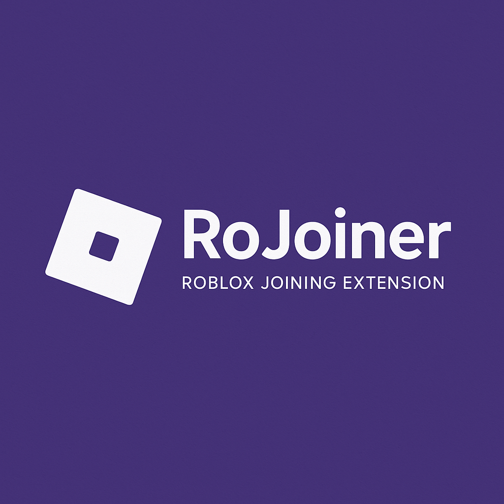

  

  <h1 style="color: #0066cc;">Description</h1>
  <h3>RoJoiner est une extension de navigateur open source qui vous permet de rejoindre facilement des serveurs Roblox spécifiques en utilisant des codes de redirection. Oubliez les méthodes compliquées, avec RoJoiner, il vous suffit de coller un code et de cliquer sur "Rejoindre" !
</h3>

  <h1 style="color: #0066cc;">Installation</h1>
  <h3>
    <b>Chrome / Edge / Navigateurs basés sur Chromium</b> 
    Téléchargez ou clonez ce dépôt sur votre ordinateur 
    Ouvrez la page des extensions (chrome://extensions/ ou edge://extensions/) 
    Activez le "Mode développeur" (en haut à droite) 
    Cliquez sur "Charger l'extension non empaquetée" 
    Sélectionnez le dossier où vous avez téléchargé/cloné le dépôt
      
    <b>Firefox</b> 
    Téléchargez ou clonez ce dépôt sur votre ordinateur 
    Ouvrez Firefox et accédez à about:debugging#/runtime/this-firefox 
    Cliquez sur "Charger un module temporaire..." 
    Sélectionnez le fichier manifest.json dans le dossier du dépôt
  </h3>

