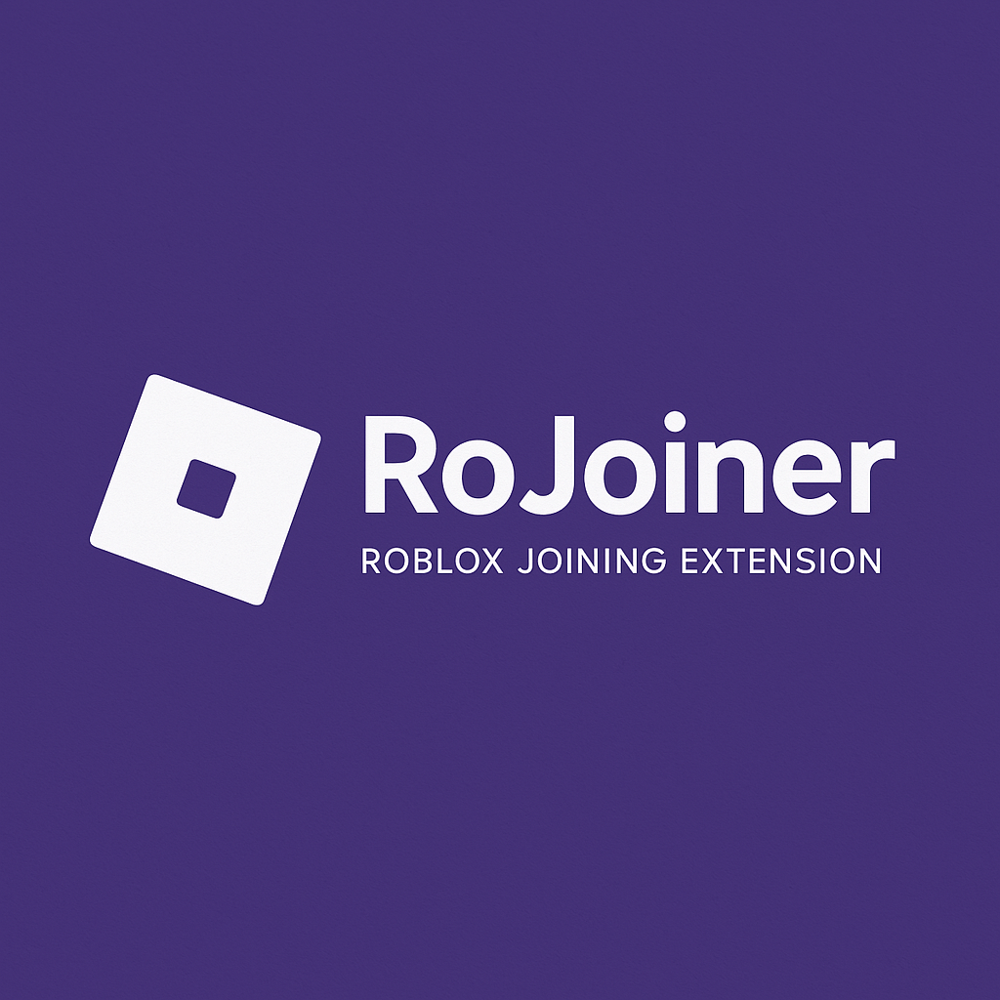

  

- **Description**
RoJoiner est une extension de navigateur open source qui vous permet de rejoindre facilement des serveurs Roblox spécifiques en utilisant des codes de redirection. Oubliez les méthodes compliquées, avec RoJoiner, il vous suffit de coller un code et de cliquer sur "Rejoindre" !

- **Fonctionnalités**

Interface simple et intuitive
Prise en charge de deux formats de code :

Code Console : Roblox.GameLauncher.joinGameInstance(123456789, "abcdef-12345-6789")
Script Executor : game:GetService("TeleportService"):TeleportToPlaceInstance(123456789, "abcdef-12345-6789", game.Players.LocalPlayer)
Redirection automatique vers le serveur Roblox spécifique
Design moderne adapté au thème discord

- **Installation**
Chrome / Edge / Navigateurs basés sur Chromium

Téléchargez ou clonez ce dépôt sur votre ordinateur
Ouvrez la page des extensions (chrome://extensions/ ou edge://extensions/)
Activez le "Mode développeur" (en haut à droite)
Cliquez sur "Charger l'extension non empaquetée"
Sélectionnez le dossier où vous avez téléchargé/cloné le dépôt

- **Firefox**

Téléchargez ou clonez ce dépôt sur votre ordinateur
Ouvrez Firefox et accédez à about#/runtime/this-firefox
Cliquez sur "Charger un module temporaire..."
Sélectionnez le fichier manifest.json dans le dossier du dépôt

- **Utilisation**

Cliquez sur l'icône de l'extension dans votre barre d'outils
Collez le code fourni par notre bot Discord
Cliquez sur "Rejoindre"
Confirmez l'ouverture de Roblox lorsque le navigateur vous le demande

- **Open Source**
Cette extension est entièrement open source sous licence MIT. Cela signifie que vous êtes libre de :

Utiliser l'extension à des fins personnelles ou commerciales
Modifier le code selon vos besoins
Distribuer votre version modifiée
Contribuer au projet en soumettant des pull requests

- **Contribution**

Fork le projet
Créer une branche pour votre fonctionnalité (git checkout -b feature/amazing-feature)
Commit vos changements (git commit -m 'Add some amazing feature')
Push sur la branche (git push origin feature/amazing-feature)
Ouvrir une Pull Request

📞 Contact
Créé par Teapot - N'hésitez pas à me contacter pour toute question ou suggestion !
Discord : [[Lien du DIscord](https://discord.gg/PPauGZAy4Y)]
